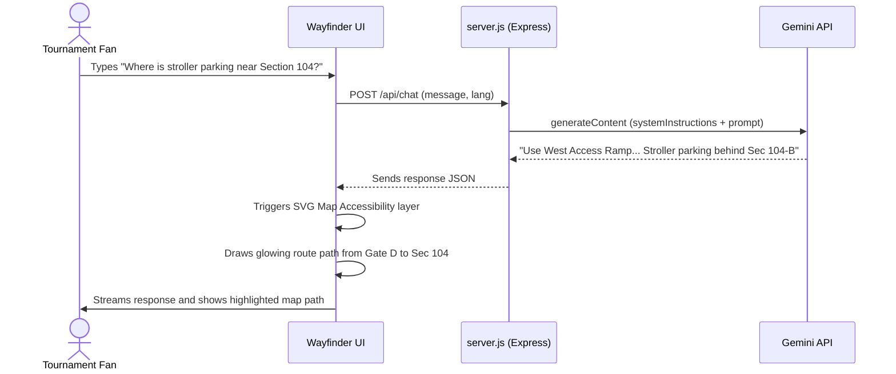
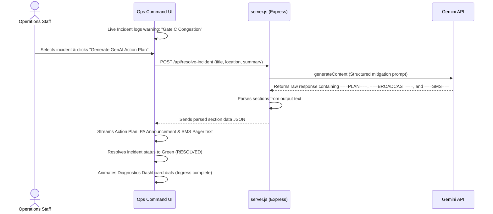

# ArenaPulse AI Hub - FIFA World Cup 2026™

ArenaPulse AI is a premium, GenAI-enabled stadium operations and fan experience portal designed for the FIFA World Cup 2026. The solution leverages the Google Gemini API to optimize navigation, crowd management, accessibility, transportation, sustainability, and real-time decision support.

---

## 🌟 Key Features

### 1. Fan Companion Portal
- **Multilingual AI Concierge**: Chatbot powered by live Gemini API (`gemini-1.5-flash`) that guides fans on seating navigation, stroller-accessible lanes, and halal/vegan dining.
- **Dynamic Wayfinder Map**: Interactive SVG stadium layout overlaying accessibility routes, zero-waste eco-hubs, and live crowd density heatmaps.
- **Dallas Matchday Alert Ticker**: Dynamic alert marquee ticker delivering real-time transit and security broadcasts.

### 2. Operations Command Center (Staff View)
- **CCTV Live Monitor**: Simulated live camera feeds (CAM-103 Seating Bowl) demonstrating operational telemetry.
- **Incident Dispatch Console**: A real-time incident queue tracking pending alerts (such as gate congestion, waste overflows, or equipment failures).
- **GenAI Decision Support**: Operations coordinator that analyzes incidents using Gemini to generate:
  - **Action Plan**: Actionable steps for venue staff.
  - **PA Broadcast logs**: Multi-lingual announcements (English, Spanish, French).
  - **SMS/Pager Dispatch**: Instant routing instruction logs for ground volunteers.
- **Arena Diagnostics Dashboard**: Live telemetry meters tracking ingress completion rates, transit efficiency, and sustainability recycling rates.

---

## 🏗️ Architecture & Data Flow

This flowchart illustrates how data moves through the ArenaPulse AI server to query Gemini and update both the fan and staff interfaces:

```mermaid
flowchart TD
    %% User Interfaces
    subgraph Client [Frontend UI - browser]
        FanUI[Fan Companion Portal]
        OpsUI[Operations Command Center]
    end

    %% Web Server
    subgraph Server [Backend - Express.js]
        Express[server.js File Server]
        ChatRoute[/api/chat]
        ResolveRoute[/api/resolve-incident]
    end

    %% GenAI
    subgraph GenAI [Google Gemini API]
        Gemini[gemini-1.5-flash]
    end

    %% Connections
    FanUI -->|User prompt| ChatRoute
    OpsUI -->|Incident details| ResolveRoute

    ChatRoute -->|System instructions & Prompt| Gemini
    ResolveRoute -->|Mitigation instructions & details| Gemini

    Gemini -->|Concierge Response| ChatRoute
    Gemini -->|Action Plan, PA & SMS logs| ResolveRoute

    ChatRoute -->|Stream back response| FanUI
    ResolveRoute -->|Stream resolution sections| OpsUI
```

---

## 🔄 User & Operations Flows

### Fan Navigation & Wayfinder Flow
The sequence diagram below displays the steps when a fan requests stroller-accessible parking:



### Operational Incident Resolution Flow
The sequence diagram below displays the steps when stadium command handles a gate congestion warning:



---

## 🚀 Getting Started

### 📋 Prerequisites
- **Node.js** (v18.0.0 or higher)
- **NPM** (v9.0.0 or higher)

### 💻 Installation
1. Clone or download this project folder.
2. Open your terminal in the directory and run:
   ```bash
   npm install
   ```

### ⚡ Running the Platform
1. Start the Express server:
   ```bash
   npm start
   ```
2. Open your browser and navigate to:
   ```
   http://localhost:3000
   ```
