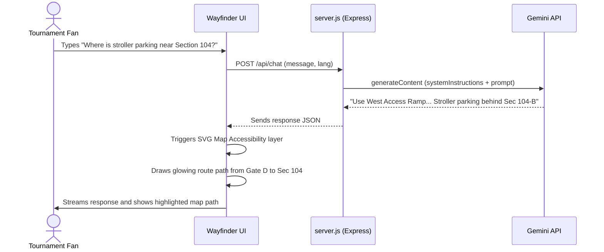
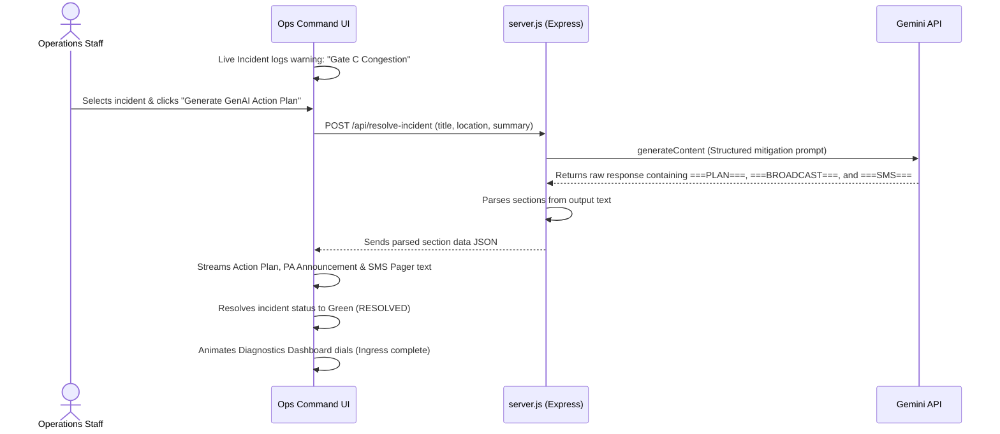

# 🏟️ ArenaPulse AI - FIFA World Cup 2026™

An advanced, GenAI-powered stadium operations command dashboard and fan experience portal designed for the **FIFA World Cup 2026** Dallas host venue. The platform optimizes crowd flow, transit waiting times, wayfinding navigation, accessibility routing, and sustainability tracking in real time.

---

## 🚀 Core Features

ArenaPulse AI operates in two distinct, responsive views:

### 📱 Fan Companion Portal
* **Multilingual AI Concierge**: Powered by Google Gemini 3.5, answering fan inquiries on transit schedules, food preferences (vegan, halal), and accessibility pathways.
* **Smart Wayfinder Map**: Interactive SVG stadium map detailing seating sectors, recycling hubs, and accessibility lanes with dynamic route path highlighting.
* **Live Ingress Alert Ticker**: Dynamic broadcast marquee ticker for safety announcements and stadium news.

### ⚙️ Operations Command Center
* **CCTV Live Monitor**: Real-time visual stadium seat view telemetry showing fan ingress density.
* **Incident Dispatch Console**: Active queue log tracking active stadium reports (e.g., gate bottlenecks, waste bin capacity).
* **GenAI Operational Resolver**: Instant AI-generated mitigation strategies, multi-lingual PA scripts, and volunteer pager logs.
* **Arena Diagnostics**: Visual analytics meters tracking ingress percentage, shuttle transit ETAs, and eco-recycling metrics.

---

## 🛠️ Technology Stack

| Component | Technology | Description |
| :--- | :--- | :--- |
| **Frontend** | Core HTML5 & Vanilla JavaScript | UI structure and responsive logic |
| **Styling** | Vanilla CSS3 (Bright Glassmorphism) | Premium styling, layouts, and animations |
| **Backend** | Node.js & Express.js | API routing and web resource server |
| **AI Integration** | Google Gemini API (`gemini-3.5-flash`) | Generates real-time chatbot replies and incident resolution plans |
| **Environment** | Dotenv | Manages secure API keys locally |

---

## 📊 System Architecture & Flows


### 1. Fan Concierge & Map Interaction Flow
Below is the sequence diagram illustrating how a fan's pathfinding request highlights the interactive map:



---

### 2. Operational Incident Mitigation Flow
Below is the sequence diagram showing how command staff resolves a live gate congestion warning:



---

## 📁 Directory Structure

```text
Ch4/
├── node_modules/          # Installed dependencies (Express, Dotenv)
├── .env                   # Local credentials (ignored by git)
├── .gitignore             # Configured ignore patterns
├── app.js                 # Frontend orchestration and interactive script
├── fifa_fans_cheering.png # Live fan atmosphere banner
├── fifa_stadium_crowd.png # Live CCTV seating bowl display image
├── index.html             # Dashboard structure template
├── LICENSE                # Project license details
├── package.json           # Project manifest and package configurations
├── README.md              # Project documentation
├── server.js              # Express backend server with Gemini API routes
└── style.css              # Premium light-mode glassmorphic theme stylesheet
```

---

## ⚙️ Setup & Installation

### 📋 Prerequisites
- **Node.js** (v18.0.0 or higher)
- **NPM** (v9.0.0 or higher)

### 💻 Installation
1. Clone or download this project folder.
2. Open a terminal inside the project directory and run:
   ```bash
   npm install
   ```

### 🔑 API Environment Configurations

> [!IMPORTANT]
> To use the live Gemini API integration, you must configure your API key locally.

1. In the root directory, create a file named `.env` (this file is ignored by Git):
   ```env
   GEMINI_API_KEY=your_gemini_api_key_here
   PORT=3000
   ```
2. Save the file. If no API key is specified, the application will automatically run in offline mode using pre-seeded local databases.

### ⚡ Running the Dashboard
1. Start the Express server:
   ```bash
   npm start
   ```
2. Open your browser and navigate to:
   ```
   http://localhost:3000
   ```
